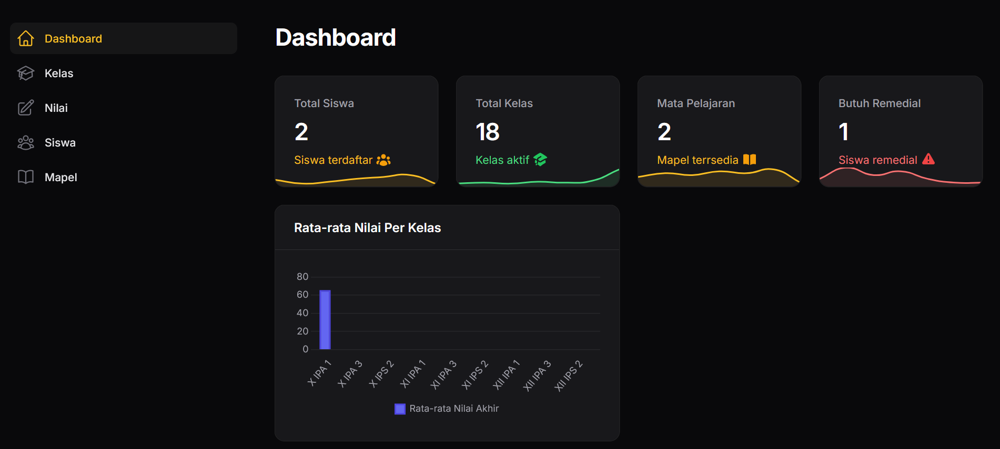
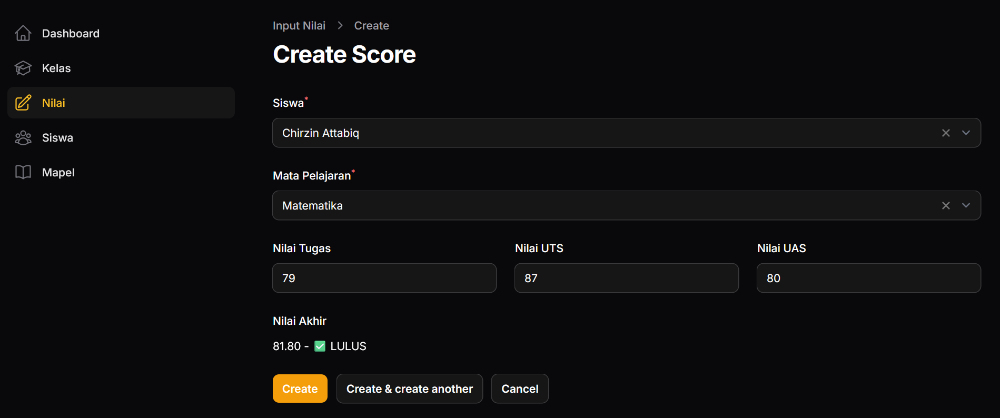
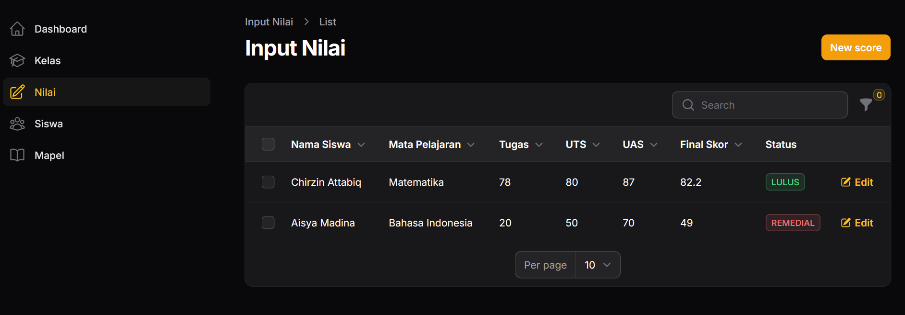
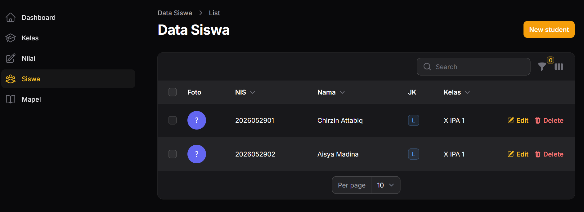

# 📚 Aplikasi Manajemen Penilaian Siswa

Aplikasi manajemen penilaian siswa berbasis web yang dibangun menggunakan **Laravel 12**, **Filament 3**, dan **MySQL**. Aplikasi ini memudahkan sekolah dalam mengelola data siswa, mata pelajaran, input nilai, hingga menampilkan dashboard analitik.

---

## 🚀 Teknologi

| Teknologi | Versi |
| --------- | ----- |
| Laravel   | 12.x  |
| Filament  | 3.x   |
| MySQL     | 8.0+  |

---

## ✨ Fitur Utama

### 🔐 Autentikasi

- Login admin / guru
- Multi-user role

### 👥 Manajemen Data Master

- **Kelola Kelas** — CRUD data kelas (X IPA 1, XI IPS 2, dll)
- **Kelola Siswa** — CRUD data siswa + upload foto + NIS auto-generate
- **Kelola Mata Pelajaran** — CRUD mapel + KKM (Kriteria Ketuntasan Minimal)

### 📝 Manajemen Nilai

- Input nilai Tugas, UTS, UAS per siswa per mapel
- **Nilai akhir otomatis** dihitung (30% Tugas + 30% UTS + 40% UAS)
- Preview nilai akhir **real-time** di form
- Badge **Lulus / Remedial** otomatis
- Filter data berdasarkan status nilai

### 📊 Dashboard Analitik

- Statistik: Total Siswa, Kelas, Mapel, Siswa Remedial
- **Chart rata-rata nilai per kelas**
- Tabel 10 siswa butuh remedial terbaru

### ✅ Validasi & Error Handling

- Validasi input (min 0, max 100, required)
- Pesan error kustom per field
- Notifikasi popup sukses/gagal

---

## 📸 Screenshot

### Dashboard



### Input Nilai



### Tabel Nilai



### Data Siswa



---

## 🛠️ Instalasi

### Langkah Instalasi

```bash
# 1. Clone repository
git clone https://github.com/chirzin633/filament-score-app.git
cd filament-score-app

# 2. Install dependencies
composer install
npm install

# 3. Copy environment file
cp .env.example .env

# 4. Konfigurasi database di .env
# DB_CONNECTION=mysql
# DB_HOST=127.0.0.1
# DB_PORT=3306
# DB_DATABASE=db_laravel_score_app
# DB_USERNAME=root
# DB_PASSWORD=

# 5. Generate application key
php artisan key:generate

# 6. Jalankan migration
php artisan migrate:fresh

# 7. Buat user admin
php artisan make:filament-user

# 8. Jalankan server
composer run dev

# 9. Buka di browser
# http://127.0.0.1:8000/admin
```
